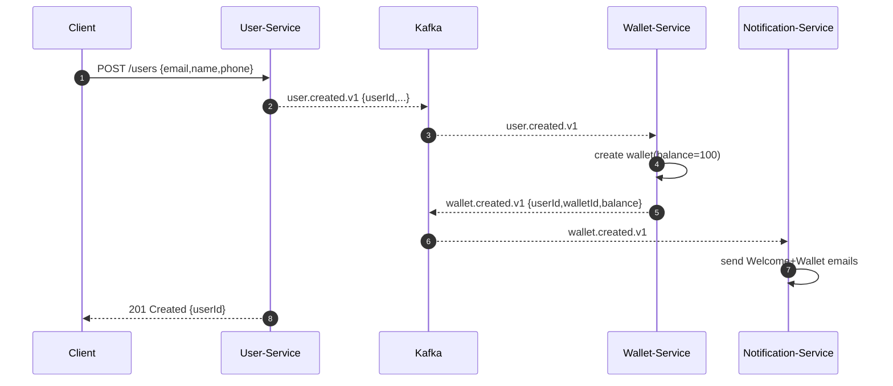
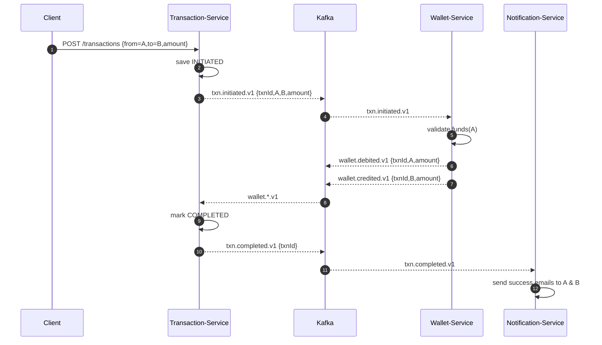

# Major-Project — Payment Wallet (Kafka Microservices)

> Version: 1.0 · Date: 28 Sep 2025

---

## 1) Requirement Discussion

### Functional
- User registration & profile management
- Wallet creation & balance management
- Peer-to-peer transfer (User A → User B)
- Email/SMS/app notifications
- Transaction history & statuses (INITIATED, VALIDATED, SUCCESS, FAILED, REVERSED)
- Admin/reporting endpoints (basic)

### Non‑Functional
- **Reliability:** exactly-once processing where feasible, idempotent operations
- **Scalability:** horizontal scale on services and Kafka consumers
- **Resilience:** retries, DLQ, circuit breakers, bulkheads
- **Security:** JWT auth, TLS, secrets management, PII encryption at rest
- **Observability:** logs, metrics, traces (OpenTelemetry), audit trail
- **Data:** ACID for wallet/transaction tables, outbox pattern for Kafka

### Tech Stack (proposed)
- **Backend:** Spring Boot 3.x, Java 17+
- **Broker:** Apache Kafka (with Schema Registry optional)
- **DB:** MySQL/PostgreSQL; Redis for caching (profiles, idempotency keys)
- **Discovery/Gateway:** Eureka (or Consul) + Spring Cloud Gateway
- **Infra:** Docker Compose (local), Kubernetes (prod), Nginx (edge)
- **Email:** SMTP (e.g., Gmail/SES/SendGrid)
- **Secrets:** Docker/K8s secrets, Vault (optional)

---

## 2) Design Discussion (High-Level)

### Microservices
1. **User-Service** — user profile, KYC-lite, wallet bootstrap trigger
2. **Wallet-Service** — wallet ledger, balance checks, holds, debit/credit
3. **Transaction-Service** — orchestrates P2P transfers (saga)
4. **Notification-Service** — email/SMS/app notifications, templating

### Kafka Topics (suggested)
- `user.created.v1` (User-Service → Wallet/Notification)
- `wallet.created.v1` (Wallet-Service → Notification)
- `txn.initiated.v1` (Transaction-Service → Wallet-Service)
- `txn.validated.v1` (Transaction-Service → Wallet-Service)
- `wallet.debited.v1` / `wallet.credited.v1` (Wallet-Service → Transaction/Notification)
- `txn.completed.v1` / `txn.failed.v1` (Transaction-Service → Notification)
- `email.requested.v1` / `email.sent.v1` (Notification-Service)
- `*.dlq.v1` dead-letter topics

> **Keying:** Use business id as key (userId, walletId, txnId) to preserve order per entity.

### Data Ownership (per service)
- **User-Service:** `users` table
- **Wallet-Service:** `wallets`, `wallet_ledger`
- **Transaction-Service:** `transactions`, `txn_events`
- **Notification-Service:** `email_outbox`, `templates`

### Consistency & Reliability
- Outbox pattern per service for publishing domain events
- Idempotency with request keys (`Idempotency-Key` header + Redis)
- Optimistic locking on wallet rows; pair with **serialized per-wallet** processing (partitioning by walletId)
- Exactly-once: enable transactional producer & consumer where applicable

---

## 3) Service Specs

### 3.1 User-Service
**Responsibilities**
- Register user → persist & cache
- Emit `user.created.v1`

**REST Endpoints**
- `POST /api/v1/users` register
- `GET /api/v1/users/{id}` fetch

**DB** (`users`)
- `id` (PK, UUID/long), `email` (unique), `name`, `phone`, `status`, `created_at`

**Events Produced**
- `user.created.v1 { userId, email, name }`

**Consumes**
- (optional) `email.sent.v1` (for audit)

**Cache**
- Redis: `user:{id}`

**Errors**
- Duplicate email → 409; validation 400

---

### 3.2 Wallet-Service
**Responsibilities**
- Create wallet on `user.created.v1` with initial balance 100 INR
- Maintain balances & ledger; debit/credit atomically

**REST Endpoints**
- `GET /api/v1/wallets/{userId}` balance

**DB**
- `wallets(id PK, user_id unique, balance DECIMAL(18,2), version)`
- `wallet_ledger(id PK, wallet_id, txn_id, type DEBIT|CREDIT, amount, balance_after, created_at)`

**Events Produced**
- `wallet.created.v1 { userId, walletId, balance }`
- `wallet.debited.v1 / wallet.credited.v1 { txnId, userId, amount, balance }`

**Consumes**
- `user.created.v1` (create wallet)
- `txn.initiated.v1` (reserve/validate funds?)
- `txn.validated.v1` (perform debit/credit)

**Concurrency**
- Optimistic locking on `wallets.version`
- Partition by `walletId` to serialize updates per wallet

---

### 3.3 Transaction-Service
**Responsibilities**
- Orchestrate transfers; validate, instruct wallet updates; finalize status

**REST Endpoints**
- `POST /api/v1/transactions` { fromUserId, toUserId, amount, note }
- `GET /api/v1/transactions/{id}`

**DB**
- `transactions(id PK, from_user_id, to_user_id, amount, status, created_at, updated_at)`
- `txn_events(id, txn_id, type, payload, created_at)`

**Flow**
1. Persist `transactions` with `INITIATED`
2. Publish `txn.initiated.v1`
3. Optional validation (KYC/limits) → `txn.validated.v1`
4. On wallet events, mark `SUCCESS`/`FAILED` and publish final status

**Events Produced**
- `txn.initiated.v1`, `txn.validated.v1`, `txn.completed.v1`, `txn.failed.v1`

**Consumes**
- `wallet.debited.v1`, `wallet.credited.v1`

**Idempotency**
- Deduplicate by `txnId`; store processed offsets/event ids

---

### 3.4 Notification-Service
**Responsibilities**
- Send email/SMS/app notifications

**Consumes**
- `user.created.v1`, `wallet.created.v1`, `wallet.*`, `txn.*`

**Templates**
- `WELCOME`, `WALLET_UPDATE`, `TXN_SUCCESS`, `TXN_FAIL`

**Outbox**
- `email_outbox(id, type, to, subject, body, status)`

---

## 4) Edge Design with Nginx & Payment Gateway (Extra)

### 4.1 Nginx
- TLS termination, HTTP/2, gzip, rate‑limit (per IP, per user)
- Reverse proxy to **API Gateway** (Spring Cloud Gateway)
- Static throttle for `/transactions` to mitigate abuse

```nginx
server {
  listen 443 ssl http2;
  server_name wallet.example.com;
  ssl_certificate /etc/ssl/fullchain.pem;
  ssl_certificate_key /etc/ssl/privkey.pem;

  location /api/ {
    proxy_set_header X-Request-Id $request_id;
    proxy_pass http://api-gateway:8080/;
  }
}
```

### 4.2 Payment Gateway (mockable)
- **Checkout**: `POST /pg/v1/pay` → redirects to hosted page
- **Callback/Webhook**: `POST /pg/v1/webhook` → Transaction-Service validates signature, correlates `txnId`
- Use HMAC (shared secret) + replay protection (timestamp + nonce)

---

## 5) User Registration — Detailed Flow

**Steps**
1. `POST /users` → create user in DB & cache
2. Publish `user.created.v1`
3. Wallet-Service consumes → creates wallet with **100 INR** initial balance & publishes `wallet.created.v1`
4. Notification-Service sends Welcome + Wallet-created emails



---

## 6) Transaction: User A → User B — Detailed Flow

**Happy Path**
1. Client calls `POST /transactions`
2. Transaction-Service stores `INITIATED` (+ idempotency key)
3. Publish `txn.initiated.v1` (and `txn.validated.v1` if sync checks pass)
4. Wallet-Service debits A, credits B (atomic per-wallet updates) and emits events
5. Transaction-Service marks `COMPLETED` and emits `txn.completed.v1`
6. Notification-Service sends emails to A & B



**Failure Paths**
- Insufficient funds → `txn.failed.v1`; only **credit** after successful **debit**; if credit fails after debit, publish **compensation event** to reverse debit (saga pattern)
- Email failure → push to `email.dlq.v1`, do not block transaction state machine

**Idempotency & Exactly-Once Hints**
- Client supplies `Idempotency-Key` header; Transaction-Service keeps `idempotency:{key}` for 24h
- Kafka producer with `enable.idempotence=true`, transactions spanning DB outbox write + send
- Consumer committal within transaction (read-process-write pattern)

---

## 7) API Sketches

**User-Service**
```http
POST /api/v1/users
Content-Type: application/json
{
  "email":"a@x.com",
  "name":"Alice",
  "phone":"90000"
}
```

**Transaction-Service**
```http
POST /api/v1/transactions
Idempotency-Key: 6f1c-...-b42e
{
  "fromUserId":7,
  "toUserId":10,
  "amount":30.00,
  "note":"Dinner"
}
```

---

## 8) Data Models (DDL — indicative)

```sql
CREATE TABLE users (
  id BIGINT PRIMARY KEY AUTO_INCREMENT,
  email VARCHAR(255) UNIQUE NOT NULL,
  name VARCHAR(120),
  phone VARCHAR(32),
  status VARCHAR(32) DEFAULT 'ACTIVE',
  created_at TIMESTAMP DEFAULT CURRENT_TIMESTAMP
);

CREATE TABLE wallets (
  id BIGINT PRIMARY KEY AUTO_INCREMENT,
  user_id BIGINT UNIQUE NOT NULL,
  balance DECIMAL(18,2) NOT NULL,
  version BIGINT NOT NULL DEFAULT 0,
  CONSTRAINT fk_wallet_user FOREIGN KEY (user_id) REFERENCES users(id)
);

CREATE TABLE wallet_ledger (
  id BIGINT PRIMARY KEY AUTO_INCREMENT,
  wallet_id BIGINT NOT NULL,
  txn_id BIGINT NOT NULL,
  type VARCHAR(10) NOT NULL,
  amount DECIMAL(18,2) NOT NULL,
  balance_after DECIMAL(18,2) NOT NULL,
  created_at TIMESTAMP DEFAULT CURRENT_TIMESTAMP
);

CREATE TABLE transactions (
  id BIGINT PRIMARY KEY AUTO_INCREMENT,
  from_user_id BIGINT NOT NULL,
  to_user_id BIGINT NOT NULL,
  amount DECIMAL(18,2) NOT NULL,
  status VARCHAR(20) NOT NULL,
  created_at TIMESTAMP DEFAULT CURRENT_TIMESTAMP,
  updated_at TIMESTAMP NULL
);
```

---

## 9) Configuration Hints

```properties
# Kafka (Spring)
spring.kafka.producer.acks=all
spring.kafka.producer.enable-idempotence=true
spring.kafka.producer.properties.max.in.flight.requests.per.connection=5
spring.kafka.consumer.enable-auto-commit=false
spring.kafka.listener.ack-mode=MANUAL

# DB
spring.jpa.open-in-view=false
spring.jpa.hibernate.ddl-auto=validate

# Email
mail.smtp.host=smtp.gmail.com
mail.smtp.port=587
mail.smtp.starttls.enable=true
```

---

## 10) Observability & Ops
- **Metrics:** JVM, HTTP, Kafka (consumer lag), DB
- **Tracing:** OpenTelemetry (trace user→txn→wallet→notification)
- **Logging:** JSON logs + correlation ids
- **DLQ Processing:** scheduled consumers with alerting
- **Kafka UI:** deploy `provectus/kafka-ui` locally for inspection

---

## 11) Security
- JWT for all internal/external APIs; Gateway enforces authN/Z
- Encrypt PII at rest (email/phone), mask in logs
- TLS everywhere (Nginx edge + mTLS service-to-service optional)
- Input validation; size limits on request bodies

---

## 12) Local Dev (Docker Compose — outline)
```yaml
version: "3.8"
services:
  zookeeper:
    image: confluentinc/cp-zookeeper:7.6.1
  kafka:
    image: confluentinc/cp-kafka:7.6.1
  schema-registry:
    image: confluentinc/cp-schema-registry:7.6.1
  mysql:
    image: mysql:8
  redis:
    image: redis:7
  kafka-ui:
    image: provectuslabs/kafka-ui:latest
  api-gateway:
    build: ./api-gateway
  user-service:
    build: ./user-service
  wallet-service:
    build: ./wallet-service
  transaction-service:
    build: ./transaction-service
  notification-service:
    build: ./notification-service
```

---

## 13) Repository Analysis & Gaps
- **Modules present:** `user-service`, `wallet-service`, `Transaction-service`, `notification-service`, `Common-CodeBase` (shared DTO/events)
- **Initial state:** early scaffolding; ensure each service has its own `pom.xml` and independent build/run
- **Add**: top-level README with runbook, env vars, topic names, and Postman collection
- **Common-CodeBase caution:** avoid tight coupling; prefer versioned schema (Avro/JSON) and publish as a dependency artifact
- **Topics:** standardize names & keys; document partitions and retention
- **Testing:** contract tests (Spring Cloud Contract), consumer lag alerts, saga happy/failed paths
- **Resilience:** retries with backoff; DLQs per consumer group; compensations in Transaction-Service

---

## 14) Next Steps
1. Finalize topic schemas & Avro (optional) + add Schema Registry
2. Implement **User-Service** registration + `user.created.v1`
3. Implement **Wallet-Service** consumer + initial 100 INR wallet creation
4. Implement **Transaction-Service** orchestration & idempotency
5. Implement **Notification-Service** templates + email sender outbox
6. Wire Nginx + Gateway; add TLS & rate limit rules
7. Ship Docker Compose for local; add Makefile scripts

---

## 15) Acceptance Criteria (Phase‑1)
- Registering a user creates user **and** wallet (100 INR), sends welcome email
- Posting a transaction debits A, credits B, updates status, and sends emails
- All inter‑service communications via Kafka; DLQs exist; basic dashboards live

"# Kafka-Microservice-Payment-wallet" 
